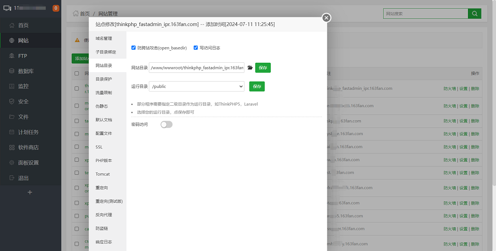
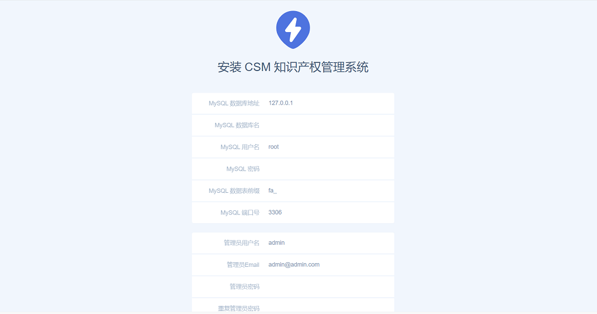
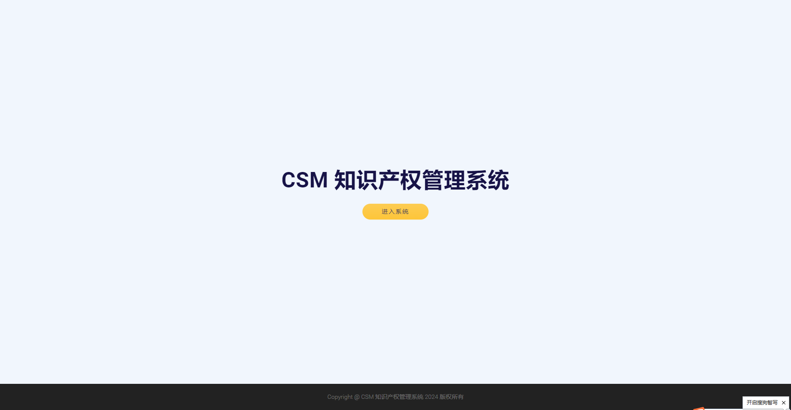
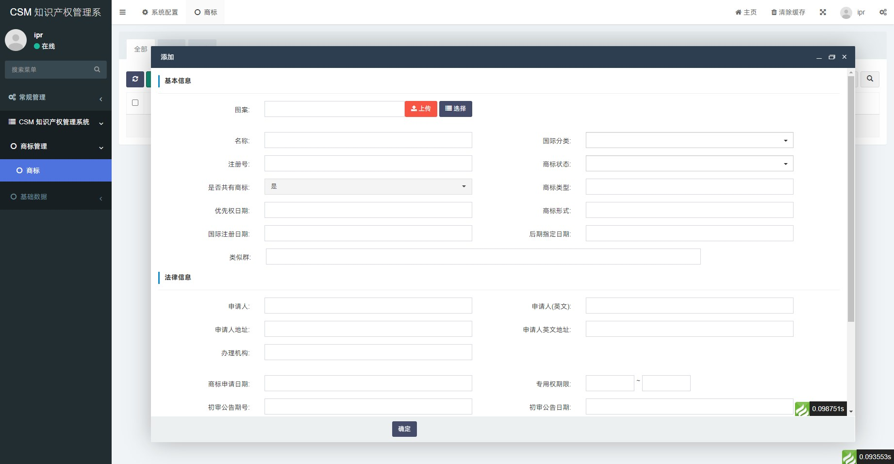

CSM 知识产权管理系统赋能企业对企业的商标、专利和著作权的沉淀和管理，替代传统Excel方式。

## 功能清单
* 商标管理
    * 商标库管理（已完成）
    * 外网数据自动同步（排期中）
    * 许可管理（排期中）
    * 流程管理（排期中）
    * 续费预警（排期中）
* 专利管理
    * 专利管理（开发中）
    * 外网数据自动同步（排期中）
    * 许可管理（排期中）
    * 流程管理（排期中）
    * 续费预警（排期中）
* 著作权管理
    * 商标库管理（排期中）
    * 外网数据自动同步（排期中）
    * 许可管理（排期中）
    * 流程管理（排期中）
    * 续费预警（排期中）
* 系统管理
    * 账号管理（已完成）
    * 个人信息管理（已完成）
    * 部门管理（排期中）
    * 子公司管理（排期中）
* 其他
    * 移动端支持（排期中）
    * 报表支持（排期中）
    * 预警管理（排期中）

## 安装使用

* 安装 Nginx+Mysql+PHP 运行环境
* 下载源码，网站目录设置指向到 %本项目%/public 目录,以宝塔为例,设置如下

* 域名访问后，进入到安装程序

## 在线演示

https://ipr.163fan.com

用户名：ipr

密　码：123456

提　示：演示站数据无法进行修改，请下载源码安装体验全部功能

## 界面截图

## 部署环境
* Mysql 5+
* Nginx
* PHP 7

## 技术架构
* PHP 7.x , Mysql 5.x 和 Nginx/Apache ，可以用宝塔、LAMP和WAMP等集成环境部署
* Thinkphp 5.x，Fastadmin 1.x
* Bootstrap 3.x , JQuery 2.1.x

## 问题反馈 & 新需求新想法

目前产品正在需求整理中，如您有新想法随时联系我

联系方式: chenshiming0802@163.com

Github: https://github.com/chenshiming0802/thinkphp_fastadmin_ipr

Gitee: https://gitee.com/chenshiming0802/thinkphp_fastadmin_ipr

## 特别鸣谢

感谢以下的项目,排名不分先后

ThinkPHP：http://www.thinkphp.cn

AdminLTE：https://adminlte.io

Bootstrap：http://getbootstrap.com

jQuery：http://jquery.com

Bootstrap-table：https://github.com/wenzhixin/bootstrap-table

Nice-validator: https://validator.niceue.com

SelectPage: https://github.com/TerryZ/SelectPage

Layer: https://layuion.com/layer/

DropzoneJS: https://www.dropzonejs.com

SDNode: https://gitee.com/sdnode/xstack

## 版权信息

本遵循AGPL-3.0开源协议发布。

本项目包含的第三方源码和二进制文件之版权信息另行标注。

版权所有Copyright © 2017-2024 by chenshiming0802 (https://ipr.163fan.com)

All rights reserved。
